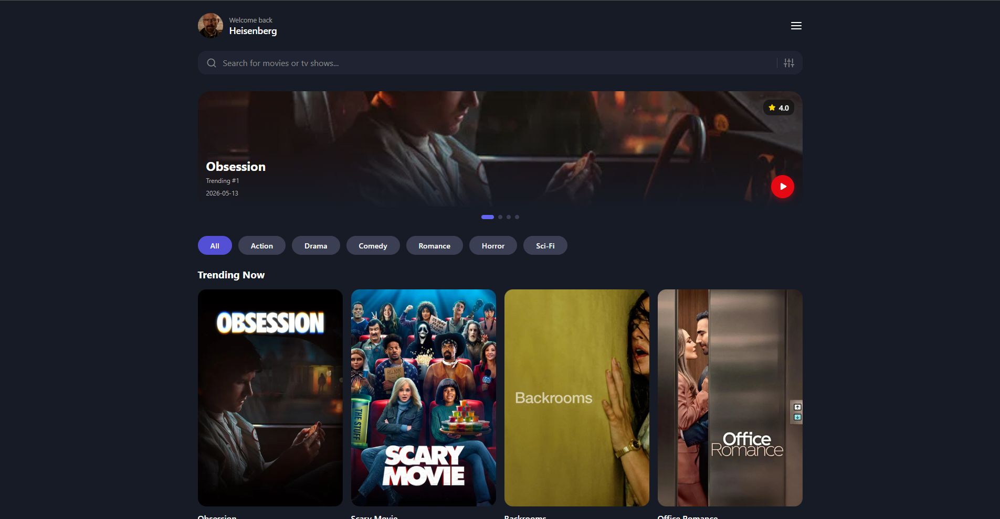

# 🎬 MyFilmList
 
A clean, responsive movie discovery app powered by the TMDB API. Search any film, explore details, browse trending content (no account needed).
 
**[→ Live Demo](https://myfilmlist-app.vercel.app/)**
 
---
 
## Overview
 
MyFilmList is a front-end movie browser built as an alternative to bloated platforms. It gives you instant access to the entire TMDB catalogue: search, discover, and explore film details without sign-ups or noise.
 

 
---
 
## Features
 
- 🔍 **Search** — find any movie in the TMDB database in real time
- 🎥 **Movie details** — view synopsis, release date, rating, runtime, genres, and cast
- 📈 **Trending & popular** — browse current trending and top-rated films
- 📱 **Fully responsive** — works on desktop, tablet, and mobile
---
 
## Tech Stack
 
| Technology | Purpose |
|---|---|
| React | UI component architecture |
| TypeScript | Type safety throughout |
| Vite | Build tool and dev server |
| CSS Modules | Scoped component styling |
| TMDB API | Movie data source |
| Vercel | Deployment |
 
---
 
## Getting Started
 
### Prerequisites
 
- Node.js 18+
- A free [TMDB API key](https://www.themoviedb.org/settings/api)
### Installation
 
```bash
# Clone the repository
git clone https://github.com/nunxcc/MyFilmList.git
cd MyFilmList
 
# Install dependencies
npm install
```
 
### Environment Variables
 
Create a `.env` file in the root of the project:
 
```env
VITE_TMDB_API_KEY=your_api_key_here
```
 
### Run Locally
 
```bash
npm run dev
```
 
Open [http://localhost:5173](http://localhost:5173) in your browser.
 
---
 
## Project Structure
 
```
src/
├── components/       # Reusable UI components
├── pages/            # Route-level views
├── services/         # TMDB API calls
├── types/            # TypeScript interfaces
└── App.tsx           # Root component
```
 
---
 
## What I Learned
 
- Integrating and managing a third-party REST API with TypeScript types
- Structuring a React app with clean component separation
- Handling async data fetching, loading states, and errors
- Deploying a Vite project to Vercel with environment variable configuration
---
 
## API
 
This project uses the [TMDB API](https://www.themoviedb.org/). Data and images are provided by TMDB - this app is not affiliated with or endorsed by TMDB.
 
---
 
*Built with React + TypeScript · Deployed on Vercel*
 
